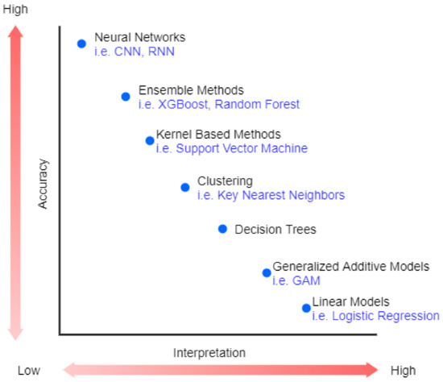

```{python}
#| label: libs
#| eval: true
import sys
import pandas as pd
import numpy as np
import seaborn as sns
import matplotlib.pyplot as plt
from IPython.display import display, Markdown, Latex

from sklearn.ensemble import HistGradientBoostingClassifier
from sklearn.inspection import PartialDependenceDisplay
from sklearn.model_selection import train_test_split

import sklearn
```

```{python}
#| label: params
#| eval: false
color_verde = "#255255"
color_verde_claro = "#BDCBCC"
color_naranja = "#FF9933"
color_azul = "#3399FF"
target = "target"
```

## Consideraciones previas

::: {style="font-size: 70%;"}
-   Este taller está orientado a `PUBLICO_OBJETIVO`. Se recomienda contar con conocimientos previos de `CONOCIMIENTOS_PREVIOS`.

-   Durante el seminario se utilizarán los siguientes paquetes:

```{python}
#| echo: false
#| eval: true
#| label: libs-versions
import matplotlib
from IPython.display import display, Markdown, Latex
Markdown(f"""
**Environment**: `{"/".join(sys.executable.split('/')[-5:])}`\n
**Python version**: `{sys.version}`\n
📦 pandas={pd.__version__}\n
📦 numpy={np.__version__}\n
📦 scikit-learn={sklearn.__version__}\n
📦 matplotlib={matplotlib.__version__}\n
📦 seaborn={sns.__version__}\n
""")
```

-   Todo el código se encuentra disponible en  <a href="https://github.com/karbartolome/workshops" target="_blank">Repositorio</a>.
:::

# Introducción a modelos de Machine Learning

# Modelos

El desarrollo de modelos predictivos implica encontrar una función de enlace entre N variables explicativas (X) y una variable objetivo (y).

$$y = f(X)$$

Esta relación es una función en modelos simples pero en modelos más complejos (ensambles, redes neuronales, etc.) no es tan claro el efecto de cada variable sobre la variable objetivo. 

## Actores involucrados

**Datos → Modelo → Predicción → Decisión → Impacto**

En el ciclo de vida de los modelos predictivos intervienen diversos actores [@molnar2025]:

- **Creadores**: desarrollan y entrenan el modelo.
- **Operadores**: interactúan directamente con el sistema.
- **Ejecutores**: toman decisiones a partir de sus predicciones.
- **Afectados** (decision subjects): reciben las consecuencias de esas decisiones.
- **Data subjects**: aportan los datos utilizados para entrenar el modelo.
- **Auditores**: evalúan, investigan y controlan el funcionamiento del sistema.

→ Cada actor puede necesitar una explicación diferente


# Inerpretabilidad de modelos

## Interpretación de modelos de Machine Learning

Existe un *trade off* entre complejidad y performance de modelos.

{#fig-iml width="30%" fig-align="center"}

Muchos analistas deciden desarrollar modelos simples en vez de modelos de caja negra (*black box*) debido a que no logran convencer a quienes deben accionar para que utilicen modelos que no tienen un funcionamiento claro, incluso sabiendo que modelos más complejos obtienen mejores métricas.  


## Explicabilidad de modelos

Las **buenas explicaciones son consistentes con las creencias previas** del usuario del modelo [@molnar2025]. 

Al desarrollar modelos supervisados de Machine Learning, se suele contar con conocimiento de dominio (creencias previas). Una forma de incorporar esto en los modelos es mediante el uso de **restricciones monotónicas**. 

Ejemplos de conocimiento de dominio:

- Predicción de precios de propiedades: se espera que a mayor cantidad de $m2$, mayor precio


# Restricciones monotónicas

## Monotonicidad

-   Una función es **monotónica creciente** si, cuando aumenta el valor de entrada, su salida no disminuye:

    -   `Si x1 <= x2: f(x1) <= f(x2)`

-   Una función es **monotónica decreciente** si, cuando aumenta el valor de entrada, su salida no aumenta:

    -   `Si x1 <= x2: f(x1) >= f(x2)`

En machine learning, una **restricción monotónica** fuerza al modelo a respetar una dirección esperada entre una variable y la predicción. Esto puede ser útil para incorporar conocimiento de dominio, reducir comportamientos contraintuitivos y mejorar la interpretabilidad y auditoría de los modelos.

Ejemplo: si se espera que al aumentar la edad caiga la probabilidad de cierto evento, se puede imponer una restricción monotónica decreciente sobre `edad`.

## Monotonicidad creciente

La función `f(x) = x ** 2` es monotónica creciente para valores de `x >= 0`: si `x` aumenta, `f(x)` también aumenta o se mantiene igual.

```{python}
x = np.linspace(0, 10, 100)
y_creciente = x**2

fig, ax = plt.subplots(figsize=(7, 4))
ax.plot(x, y_creciente, linewidth=2)
ax.set(title="Ejemplo de monotonicidad creciente", xlabel="x", ylabel="f(x) = x^2")
plt.show()
```

## Monotonicidad decreciente

La función `f(x) = exp(-x)` es monotónica decreciente: si `x` aumenta, `f(x)` disminuye.

```{python}
x = np.linspace(0, 10, 100)
y_decreciente = np.exp(-x)

fig, ax = plt.subplots(figsize=(7, 4))
ax.plot(x, y_decreciente, color="tab:red", linewidth=2)
ax.set(title="Ejemplo de monotonicidad decreciente", xlabel="x", ylabel="f(x) = exp(-x)")
plt.show()
```

# Planteo del caso

## Titulo del caso

::: {style="font-size: 70%;"}
```{python}
#| echo: true
#| eval: false
#| code-fold: true
#| code-summary: "Lectura de datos"
#| label: data

df = pd.read_csv("data/dataset.csv")
```

Se cuenta con un dataset de `N_OBSERVACIONES` observaciones y `N_VARIABLES` variables.

> Pregunta guía del taller.
:::

------------------------------------------------------------------------

# Contenido

## Primera sección

::: {style="font-size: 75%;"}
-   Idea principal.
-   Concepto clave.
-   Ejemplo o resultado.
:::

## Segunda sección

::: {style="font-size: 75%;"}
Texto, código o figura.
:::

# Comentarios finales

## Comentarios finales

::: {style="font-size: 75%;"}
-   Mensaje principal.
-   Recomendación práctica.
-   Próximo paso.
:::

## Referencias / Recursos

::: {#refs}
:::

## Contacto

 [karinabartolome](https://www.linkedin.com/in/karinabartolome/)

 [karbartolome](https://twitter.com/karbartolome)

 [karbartolome](http://github.com/karbartolome)

 [Blog](https://karbartolome-blog.netlify.app/)